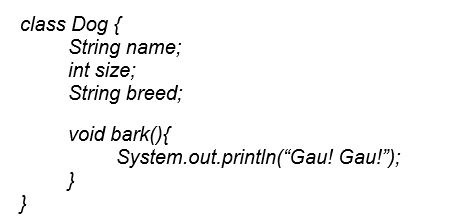
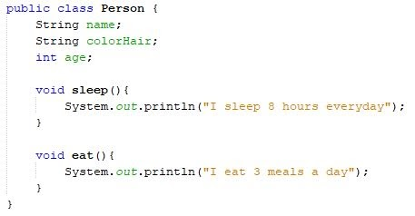
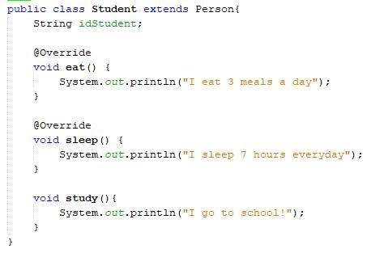
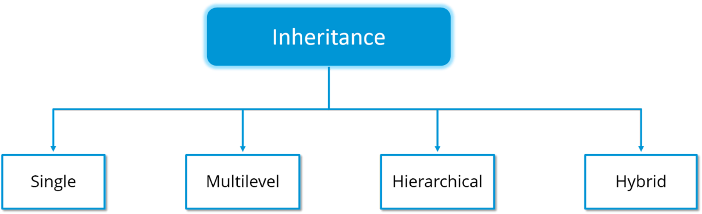
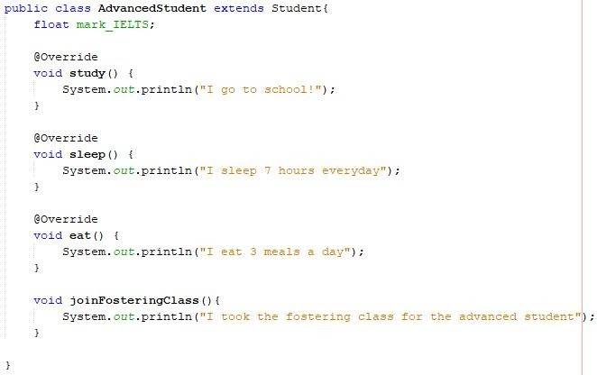
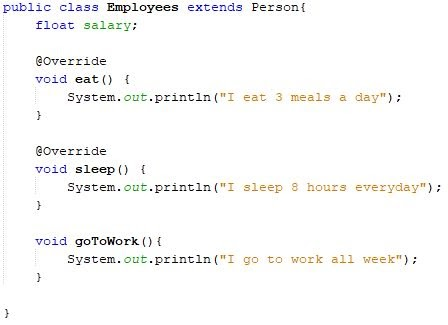
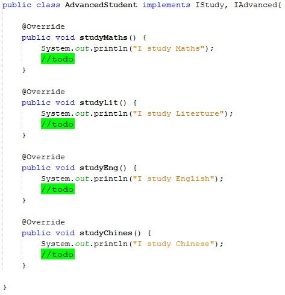
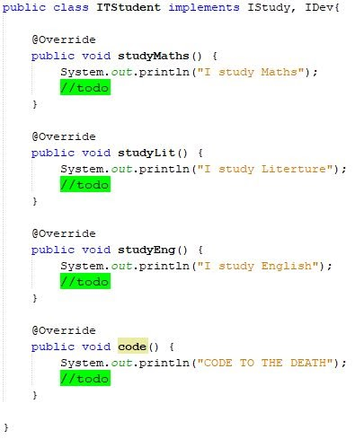


` `**[NHỮNG ĐIỀU CƠ BẢN VỀ OOP MÀ BẠN CHƯA BIẾT]**

Nếu như những ai học lập trình thì không còn quá xa lạ với chủ đề này nhưng để hiểu nó thì không phải ai cũng có thể hiểu được luôn. Chính vì vậy hôm nay mình sẽ giới thiệu lại cho mọi người để có cái nhìn tổng quan và sâu sắc hơn về OOP.

Trong bài viết này mình sẽ lấy ví dụ khá nhiều thông qua ngôn ngữ Java nhé.

1. **Overview**

Theo Wikipedia viết:

“***Lập trình hướng đối tượng** (tiếng Anh: Object-oriented programming, viết tắt: OOP) là một [mẫu hình lập trình](https://vi.wikipedia.org/wiki/M%E1%BA%ABu_h%C3%ACnh_l%E1%BA%ADp_tr%C3%ACnh) dựa trên khái niệm "[công nghệ đối tượng](https://vi.wikipedia.org/wiki/%C4%90%E1%BB%91i_t%C6%B0%E1%BB%A3ng_\(khoa_h%E1%BB%8Dc_m%C3%A1y_t%C3%ADnh\))", mà trong đó, đối tượng chứa đựng các [dữ liệu](https://vi.wikipedia.org/wiki/D%E1%BB%AF_li%E1%BB%87u), trên các [trường](https://vi.wikipedia.org/wiki/Tr%C6%B0%E1%BB%9Dng_\(khoa_h%E1%BB%8Dc_m%C3%A1y_t%C3%ADnh\)), thường được gọi là các thuộc tính; và mã nguồn, được tổ chức thành các [phương thức](https://vi.wikipedia.org/wiki/Ph%C6%B0%C6%A1ng_th%E1%BB%A9c_\(l%E1%BA%ADp_tr%C3%ACnh_m%C3%A1y_t%C3%ADnh\))...*”

Khá khó hiểu đúng không, nhưng khi nghe tên “hướng đối tượng” là các bạn cũng có thể mường tượng ra kỹ thuật này sẽ xoay quanh tới 1 đối tượng **(Object)**. Vậy lập trình hướng đối tượng là gì:

“Lập trình hướng đối tượng ( Object - Oriented Programming) là một **kỹ thuật** mô hình hóa một hệ thống **giống với thế giới thực** trong phần mềm dựa trên các đối tượng.”

Ví dụ:

Ta có một đối tượng (Object) là một con chó. Vậy theo các bạn con chó này sẽ có những đặc điểm và hành vi gì? 

Đặc điểm: tên, màu lông, giống loài, xuất xứ…

Hành vi: ăn, chơi, sủa…

Vậy ta sẽ áp dụng vào code như nào

Đó như các bạn thấy thì mình vừa tái hiện lại một đối tượng có thực trong thực tế vào trong lập trình. Chính vì thế người ta nói lập trình hướng đối tượng là một mô hình hóa hệ thống các đối tượng có thực vào trong phần mềm.

2. **Object và Class**

Như đã nói phía trên, Object là những thực thể có thực trong hiện tại, vậy nếu sẽ ra sao khi chúng ta phải tạo hẳn 38 đối tượng chỉ để thể hiện từng bạn học sinh trong một lớp? Thật ngớ ngẩn. Chính vì lý do đó mà chúng ta sẽ có một khái niệm mới đó là **Class.** 

Class là một tập hợp các đối tượng có cùng chung những đặc điểm giống nhau. 

Ta có thể hiểu đơn giản, Class như một bản thiết kế nguyên thủy, nó bao gồm tất cả những thông tin cơ bản nhất mà một đối tượng phải có. Để khi nhìn vào một Class ta có thể hình dung được ngay bản thiết kế này sẽ cho ra một sản phẩm và sản phẩm được sinh ra từ bản thiết kế này được gọi là 1 Object.

Vậy ở đây ta có thể rút ra được 2 khái niệm cơ bản:

**Class**: giống như một bản thiết kế dùng để tạo ra các Object (đối tượng), bản thân **Class** không phải là một Object.

**Object**: được tạo ra từ một Class, các **object** được tạo ra từ Class nào sẽ có đầy đủ các thuộc tính của Class đó.

3. **Bốn tính chất cơ bản của OOP** 

Trong Lập trình hướng đối tượng sẽ được chia thành 4 tính chất như sau:

- **Tính kế thừa**: Inheritance
- **Tính đóng gói**: Encapsulation
- **Tính trừu tượng**: Abstraction
- **Tính đa hình**: Polymorphism

`		`Vậy chúng ta sẽ đi tìm hiểu về tính chất đầu tiên.

1. **Tâm pháp tầng thứ nhất : Inheritance**

Nghe đến kế thừa là các bạn có thể hình dung tính chất này nói về gì rồi đúng không. Nội dung của tính chất này như sau:

“Tính kế thừa là chỉ việc một class có thể sử dụng lại những đặc điểm và tính chất của một class khác. Mục đích của tính chất này là giúp chúng ta dễ dàng mở rộng và tránh lặp code.”

Để dễ hiểu hơn ta có thể xem ví dụ ở dưới:

Ở đây mình tạo ra một class có tên là Person với những đặc điểm, hành vi chung của con người:

Ở đây với lớp Person ta có những đặc điểm và hành vi chung nhất, đây ta gọi là một **Base Class.**

Tiếp theo ta tạo một lớp con kế thừa lại lớp cha và đó là lớp Student

Ở class Student, ta kế thừa lại tất cả những thuộc tính và phương thức (method) của lớp cha thông qua từ khóa **extends**. Như bạn đã thấy thì ta cũng có thể thêm những đặc điểm, method riêng mà chỉ học sinh mới có, như vậy ta sẽ tránh bị lặp code.

Để có thể hiểu sâu hơn, tính kế thừa được chia ra làm 4 loại:

 

**1.1. Đơn kế thừa (Single Inheritance)**

`	`Đối với Đơn kế thừa, một lớp sẽ kế thừa những thuộc tính của một lớp khác. Nó cho phép một lớp con kế thừa những thuộc tính và hành vi (**method**) từ một lớp cha.

Điều này sẽ cho phép code khả năng tái sử dụng code cũng như thêm các tính năng mới vào các đoạn code hiện có.

Ở ví dụ bên trên, Class Person là lớp cha và Class Student là lớp con với những thuộc tính và hành vi của  lớp cha.

**1.2. Kế thừa đa cấp (Multilevel Inheritance)**

`	`Khi một lớp được bắt nguồn từ một lớp mà cũng là lớp con (kế thừa từ một lớp khác). Tức là một lớp có nhiều hơn một cấp cha, kiểu kế thừa đó được gọi là kế thừa kiểu Đa cấp.

Vẫn tiếp tục ở ví dụ trên, nếu bây giờ tôi tạo ra một lớp dành cho đối tượng học sinh giỏi thì sẽ extends lại lớp Student, lúc này class Student là lớp cha và class Person là lớp ông của lớp AdvancedStudent 

**1.3. Kế thừa thứ bậc (Hierarchical Inheritance)**

Khi một lớp có nhiều hơn một lớp con hoặc nói cách khác là có nhiều hơn một lớp con có cùng chung một lớp cha, lúc này loại kế thừa này được gọi là thứ bậc (**hierarchical)**.

Trong thực tế đâu chỉ có mỗi đối tượng học sinh là giống con người đúng không, ta còn có thể tạo ra nhiều lớp kế thừa lại lớp Person ban đầu.

**1.4. Kế thừa lai (Hybrid Inheritance)**

*“Sao chỉ có thể kế thừa 1 lớp thôi ạ, bây giờ em muốn kế thừa nhiều hơn một lớp được không, chứ như này hơi bất tiện cả không tối ưu lắm???”*

Rất tiếc là để tránh sự phức tạp cho nên trong Java không hỗ trợ sự đa kế thừa giữa các Class với nhau. **Tuy nhiên**, vẫn có cách để chúng ta đạt được sự đa kế thừa đó là sử dụng Interface thông qua từ khóa **Implements.**

Để dễ hiểu hơn mình sẽ có ví dụ như sau: Mỗi lớp trên đều có điểm chung là thuộc tính và hành vi, vậy thì mình sẽ tách riêng ra để có thể thực hiện kế thừa lai.

Ở đây mình tạo ra 3 interface là 

- IStudy (gồm những method cơ bản của một học sinh) 
- IDev (gồm những môn bắt buộc của một học sinh CNTT)
- IAdvanced (gồm môn học của một học sinh giỏi)

Sau đó mình sẽ cho các lớp đối tượng sinh viên implement những interface cần thiết để có thể sử dụng.

Như vậy ta đã có thể giải quyết được vấn đề đơn kế thừa trong Java rồi đúng không. Qua những ví dụ trên mong các bạn hiểu được tính chất đầu tiên này trong OOP. 

Trong bài viết tiếp theo, chúng ta sẽ đi tới tính chất thứ hai trong OOP đó là **tính đóng gói**.

