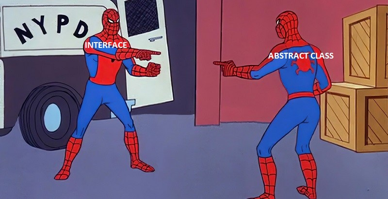
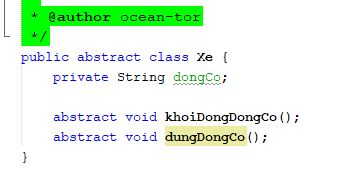
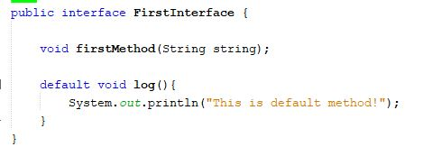
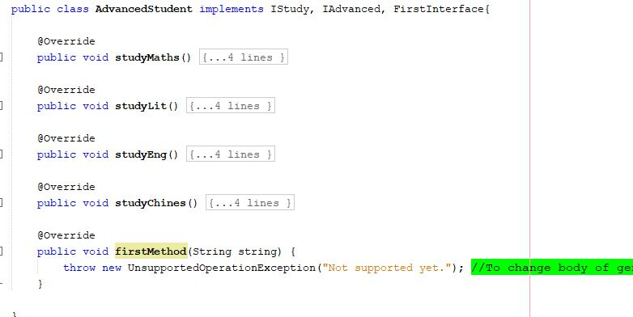

**“Anh em sinh đôi ?”**

Hey yo what’s up, chào mừng các bạn đã quay trở lại với cái bờ lóc của mình. Cơ duyên để mình lên bài này nó cũng éo le lắm, hôm đó thầy lớp mình có kiểm tra nhanh bài của mấy bạn trong lớp và có hỏi “Thế tại sao chỗ này em không dùng Interface và lại dùng Abstract Class?”, “Thế sự khác nhau giữa hai cái này là gì?”… và 101+ câu hỏi khác liên quan đến 2 đứa này và các bạn lớp mình có vẻ khá lúng túng trước câu hỏi này, ( mình cũng mất 2p để định vị lại câu trả lời sao cho “có não nhất” ). Cho nên mình lên bài này để mọi người cùng thảo luận và hiểu rõ hơn về sự khác nhau giữa Interface và Abstract Class nhé! Lẹt goooo.

**Disclimer**: Ở bài viết này mình sẽ không đi sâu vào khái niệm hay cách khai báo đâu nhé, nếu bạn nào muốn tìm hiểu kĩ hơn thì có thể đọc bài này trước rồi quay lại nhé! 

Link 8p: <https://hai-nguyen-21.github.io/posts/oop2/>

- **Abstract Class**: các bạn có thể hiểu đây như một lớp cha , có những đặc tính và hành động chung, bao quát nhất dành cho các lớp con khác. 

Ở trên mình đã tạo ra một lớp abstract **Xe** với thuộc tính là **động cơ**, cùng với phương thức là **khởi động và dừng động cơ**. Tuy nhiên **Xe** là một cái gì đó khá chung chung và trừu tượng, nó có thể là bất kì loại xe nào và khi đó các lớp con extends lại sẽ định nghĩa riêng cho từng lớp. Và khi đó thằng con (child class) chỉ có thể có duy nhất 1 lớp cha, có tính chất giống cha (abstract class) đó.

- **Interface**: Các bạn có thể hiểu Interface như một bản thiết kế, và bản thiết kế này sẽ liệt kê tất-cả-các-chức-năng cơ bản nhất mà một dự án cần sử dụng. Cơ chế của Interface cũng không khác gì bản hợp đồng, tức là khi ta “thực thi” hợp đồng này sẽ phải tuân theo các điều khoản trong đó, không có ngoại lệ. 

*“Thế nghe chừng dùng Interface bất tiện quá nhỉ, nếu ví dụ có 10 class implements một Interface nhưng chỉ có 5 class cần thêm 1 chức năng nữa, chẳng nhẽ phải viết lặp lại 5 lần trong mỗi class hay lại tạo 1 Interface mới cho riêng 5 class này?”*

Đúng, nhưng nó chỉ đúng với Java 1,2,3,4,5,6,7 thôi, lên Java 8 đã xuất hiện thêm phương thức default và static sẽ giải quyết vấn đề này.  Còn chưa kể 2 phương thức này còn có body code nhé. 

Đó thấy chưa, khi implements lại **FirstInterface** ta không cần implements default method. 

Quay trở lại với **Interface** và **Abstract Class**, theo một cách ngắn gọn, khi một class extends một Abstract Class thì mối quan hệ này được gọi là **is – a** (Ô tô là Xe) , còn khi một class implements một Interface thì mối quan hệ này là **can – do** (Ô tô có thể chạy).

Vậy túm cái quần lại, khi bạn muốn thể hiện các lớp có mối quan hệ cha con với nhau, ví dụ như voi, chó, hổ… đều là Animal.

Còn về Interface, mục đích của Interface là thể hiện tính đa hình, khả năng thực hiện các hành động khác nhau. Nếu bạn muốn thể hiện tính đa kế thừa thì dùng Interface. Ví dụ như mình muốn hỗ trợ người dùng thanh toán qua nhiều ngân hàng, mình sẽ tạo môt Interface PayMoney, sau đó nếu muốn bao nhiêu ngân hàng thì chỉ việc thực thi interface này thôi. 

Kết thúc bài viết mong các bạn có thể hiểu được phần nào về khái niệm và phân biệt được Interface và Abstract Class nhé, thầy mình thì khuyên dùng Interface :v.

Bài viết tham khảo sách: Head First Java.
