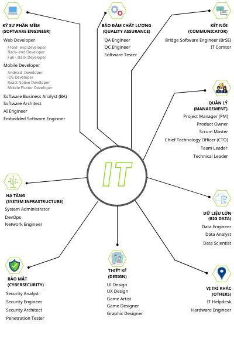
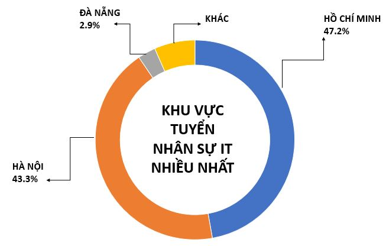
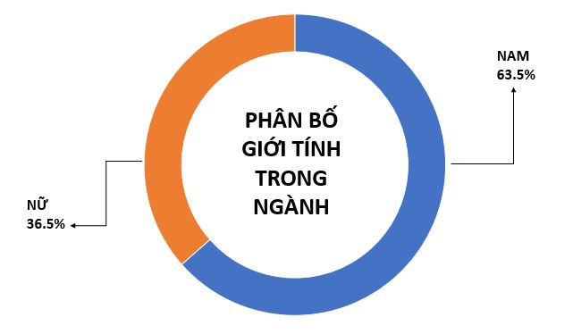

**Công nghệ thông tin – Những câu chuyện trong “Ngành”**

Heyyo, chào mừng các bạn đến với blog của mình, mình là Hải, hiện đang là sinh viên năm 2 ngành công nghệ thông tin. 

Có thể các bạn đã từng nghe những câu nói kinh điển từ những cánh báo trí như là “Lương tháng khởi điểm 1000$”, “Vua của mọi nghề”… hay là nghe phong phanh thiên hạ đồn thổi về một ông anh Bính Tý học cơ khí Bách Khoa, tất cả đều nói về độ hào nhoáng mà ngành này mang lại vậy liệu những điều trên có đúng không? Trong bài viết này, mình sẽ cùng các bạn tìm hiểu kĩ hơn về ngành này thông qua những câu hỏi kinh điển từ những kẻ ngoại đạo, để các em năm nhất có thể đem đi ứng phó với bạn bè, hay là biết cách từ chối khéo khi có ai đó nhờ cài win máy hay sửa tivi nhé.

\*Disclaimer: Những kiến thức mình chia sẻ dưới đây là thành quả của mình tìm hiểu qua sách báo và tâm sự của thầy cô, có thể sẽ có những luận điểm hơi phiến diện, các bạn đọc với tâm trí tìm hiểu thôi nhé!\*

1. **Học CNTT là làm gì?**

Đầu tiên ta phải tìm hiểu về khái niệm ngành này trước. Theo trang WordNet của trường Đại học Princeton có viết “Công nghệ thông tin (Information Teachnology) là một ngành kỹ thuật sử dụng máy tính và viễn thông để thu nhận, lưu trữ và truyền tải thông tin.” Trong một bài báo của 2 tác giả Harold J. Leavitt và Thomas L. Whisler năm 1958 có nói “Công nghệ mới này vẫn chưa có tên riêng. Chúng tôi sẽ gọi nó là công nghệ thông tin”.

“Lý thuyết lắm thế nhờ, vậy rốt cuộc học cái này xong có sửa được máy giặt không?” 

Ấy đừng nóng, thực ra ngành này rất rộng, mình cũng khá khó để trả lời trọn vẹn cho các bạn câu này vì ngành này rất đa dạng, chưa kể mỗi công ty sẽ có một mô hình riêng, các chức vụ cũng có thể chồng chéo lên nhau. Tuy nhiên sau khoảng 1 giờ tìm kiếm 7749 các website thì mình cũng có thể tổng hợp lại cho các bạn những vị trí “cơ bản” trong ngành như sau:

Nhìn vào sơ đồ trên các bạn có thể thấy ngành này của chúng ta vô cùng rộng, thậm chí mình thấy còn chưa đủ lắm đâu nhưng về cơ bản các bạn cũng có thể hình dung được phần nào về những lĩnh vực trong ngành. Có thể thấy rằng công việc của tụi mình đâu chỉ có ngồi cắm mặt máy tính viết code, bên cạnh đó còn có những lĩnh vực thú vị như làm sản phẩm (các vị trí liên quan đến product), thiết kế (design), cầu nối giữa client và team dev (BrSE, IT Compor)… Như vậy ngành IT không phải dành cho mấy ông “đầu to mắt trố”, cù lì, trầm tính đâu nhé, trong ngành cũng có những vị trí đòi hỏi sự giao tiếp, sáng tạo, thấu hiểu mọi người.

1. **“Con gái có học CNTT được không?”**

Trước khi trả lời câu này tôi sẽ cho các ông xem thống kế trên TopCV.

**Thời điểm ghi nhận: 5/2020**

*( Tổng hợp dựa trên tổng số tin đăng tuyển trên các kênh tuyển dụng IT lớn nhất: ITViec, Vietnamworks, CareerBuilder, TopDev, TopCV)*

`	`

*Bao gồm nhóm lập trình viên, tester, QA, Design, BA, nhân sự làm trong ngành, thống kê theo TopDev)*

Như các bạn cũng đã thấy, ngành CNTT thực sự rất hot trong những năm gần đây, và dự báo sẽ tăng hơn nữa trong tương lai. Quay lại với câu hỏi trên, nhìn biểu đồ thứ 2 các bạn cũng thấy tuy số lượng nam nhân viên có hơi áp đảo nhưng số lượng nhân viên nữ cũng không quá ít, trong ngành có rất nhiều vị trí cần sự tỉ mỉ, mềm dẻo khi giao tiếp chính vì vậy các bạn nữ có thể tự tin theo học, tuy nhiên theo lời cô giáo mình thì các bạn nữ sẽ có hơi “vất vả” hơn các bạn nam trong những giai đoạn đầu. Nhưng nếu bạn có niềm đam mê to lớn với máy móc thì những khó khăn kia cũng không là gì so với chúng ta đúng không. 

1. **“Lương khởi điểm của ngành này chắc cao lắm?”**

Do mình vẫn đang đi học nên không thể trả lời câu hỏi này được, tuy nhiên theo cá nhân của mình nghĩ lương cao hay thấp đều do năng lực của chính bản thân, bạn bỏ ra được nhiều thứ giá trị cho công ty thì chắc chắn con số bạn nhận lại cũng không hề nhỏ. Có một idol từng nói “Muốn ngồi ở vị trí không ai ngồi được phải làm được những việc không ai làm được” :)))). Chính vì thế mà ngành CNTT phải bỏ ra rất nhiều chất xám, hơn hẳn các công việc văn phòng khác. 

Anh A làm nhân viên văn phòng, anh B thì làm lập trình, cả hai đều làm 8 giờ mỗi ngày nhưng lương anh A chỉ có 7 triệu, anh B là 10 triệu, vậy ai là người nhiều tiền hơn? Đứa trẻ 3 tuổi cũng có thể trả lời được câu hỏi trên, tuy nhiên nếu ta suy nghĩ sâu hơn sẽ thấy, công việc của anh A có vẻ mang tính chất lặp lại mỗi ngày còn công việc anh B thì mỗi ngày đều phải giải quyết một vấn đề mới, nếu chưa giải quyết được còn phải OT thêm giờ để không cháy deadline, chưa kể còn khá nhiều áp lực khác nữa cho nên tiền lương hơn cũng đúng. 

Còn ở câu hỏi này, thầy mình cũng có nói mà mình thấy rất đúng. Lúc mới ra trường các bạn sinh viên đều sẽ bắt đầu với vị trí như fresher hoặc intern, kiến thức trong trường chắc chắn không thể giúp các bạn có thể nhảy vào dự án của công ty rồi quẩy nhiệt tình được, lúc này chúng mình nên đi làm để lấy kinh nghiệm làm trọng, trợ cấp hay lương nên xếp thứ 2, sau khi đi làm được một thời gian rồi, nếu bạn có nỗ lực, cố gắng, và giúp đỡ được công ty thì mình tin chắc cấp trên sẽ hiểu được thành quả mà bạn tạo ra.

Túm cái quần lại, thì chúng ta chỉ cần cố gắng, tạo ra được giá trị, nâng cấp bản thân từng ngày thì chắc chắn các bạn sẽ nhận lại được một mức lương hợp lý, học đi nhé!

1. **101+ câu hỏi ngoài lề nho nhỏ.**

Dưới đây là những câu hỏi mà mình nhận được từ người thân và bạn bè trong suốt 1 năm học qua, và cũng có những câu hỏi mình đã khảo sát được từ các bé 2k3, 2k4 hay các bạn khác ngành nữa.

1. ***Học CNTT sau này đi làm nghề sửa máy tính có phải không?***

KHÔNGGGG. Như các bạn đã thấy ở phần 1, mình có chỉ ra trong ngành có rất nhiều ngành nghề trong CNTT, sửa máy tính thì thấy cũng có liên quan đến máy móc đấy nhưng lại ở một mảng rất khác nhé.

1. ***Học CNTT có cần phải giỏi Toán không?***

Câu trả lời là “Có” và “Không”. Tùy vào công việc mà bạn đang làm, có những mảng bạn chỉ cần biết những thứ toán cơ bản nhưng có những mảng bạn cần phải vận dụng nội dung suốt 4 năm học trên Đại học cũng chưa chắc giải quyết được vấn đề. Tuy nhiên nếu bạn học giỏi Toán thì sẽ là một bước đệm vững chắc vì nếu giỏi Toán thì tức là bạn cũng có một lối suy nghĩ rất logic mà trong ngành này suy tư logic vô cùng quan trọng. 

1. ***Học sinh cấp 3 cần những gì cho ngành CNTT?***

Ở cấp 3 bạn có thể tập trung học những môn như Toán, Tin học để bồi đắp lối suy nghĩ logic, tham gia các cuộc thi liên quan đến Tin học vì nếu bạn học giỏi môn Pascal thì khi lên Đại học bạn học môn Nhập môn lập trình sẽ đỡ vất vả hơn.

1. ***Nên học ngôn ngữ lập trình nào để kiếm nhiều tiền?***

Thầy mình từng nói, ngôn ngữ chỉ là công cụ, nếu bạn giỏi ngôn ngữ nhưng bạn không có ý tưởng để làm thì cũng bằng không. Mục đích của lập trình là giải quyết vấn đề, vấn đề càng khó thì càng ra tiền, chính vì vậy các bạn không nên tôn sùng ngôn ngữ quá, mà thay vào đó nên rèn luyện kỹ năng cho tốt.

1. ***Có cần học Đại học mới làm được nghề này không?***

Hiện nay mình cũng không theo học Đại học mà mình chỉ đang học Cao Đẳng, tuy nhiên một tấm bằng Đại học sẽ là chìa khóa để chứng minh cho nhà tuyển dụng thấy công sức bạn bỏ ra. Ở trường Đại học sẽ giúp bạn học được những môn nền để giúp bạn lối suy nghĩ logc và giải quyết vấn đề còn để phát triển xa hơn thì lại ở bản thân các bạn, tuy nhiên các bạn học Cao đẳng hay đang học trái ngành muốn sang CNTT cũng đừng nản, nếu không có bằng Đại học thì các bạn cũng có thể đi học thêm ở trung tâm, tạo cho mình một profile thật xịn để có thể show cho nhà tuyển dụng thấy. 

Túm cái quần lại, nếu có điều kiện thì theo học Đại học nhưng đừng học đại nhé!

1. ***Sinh viên trái ngành có thể học được CNTT không?***

Các bạn sinh viên trái ngành có thể theo học CNTT được, tuy nhiên các bạn có xuất phát điểm muộn hơn các bạn khác nên phải cố gắng hơn, đừng nản mà hãy cố gắng học hỏi, kiếm cho mình một người thầy để khỏi bơi trong đống kiến thức vô tận này nhé :)))

1. ***Ngành này có cần giỏi tiếng Anh không?***

Có nhé, trong ngành mình rất cần tiếng Anh để các bạn có thể đọc hiểu tài liệu trên mạng, gặp bug còn biết fix, tuy nhiên không bắt buộc các bạn phải có bằng IELTS 8 hay 9 đâu (có thì càng tốt), nếu bạn nào ít thời gian thì thể học để thi Toeic, quan trọng các bạn cần đọc hiểu được, nghe được để xem các video bên nước ngoài, còn vụ nói thì các bạn có thể tự luyện hoặc rủ bạn bè tham gia một khóa trên Cambly có thể học nói tiếng Anh 1-1 với người bản xứ.

Trên đây là những điều mình hay và hiểu lầm của mọi người về ngành CNTT, mong sẽ giúp được các bạn, nếu các bạn thấy có vấn đề có thể comment bên dưới để mình rút kinh nghiệm trong các bài viết sau, nếu các bạn còn có những câu hỏi gì về kiến thức học thuật hay kiến thức xung quang ngành thì hãy comment bên dưới để mình tổng hợp và viết bài tiếp nhé. Dịch này ở nhà thôi nha, Stay safe and Stay home nha các bạn. Bái bai

